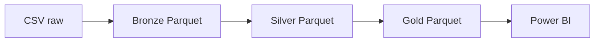

# AdventureWorks Internet Sales Analytics

Este proyecto nace de la necesidad de analizar el desempeño de las ventas por internet de AdventureWorks. El objetivo de negocio es responder preguntas como: ¿cuánto se vende por periodo?, ¿qué productos y clientes generan mayor valor?, ¿cómo se comportan las ventas por territorio, promoción y moneda?, y ¿qué indicadores permiten evaluar el rendimiento del canal online?

Para cubrir esa necesidad, se construye un datamart de ventas online con una fact table transaccional y un conjunto de dimensiones que permiten analizar la operación desde distintos ángulos. La solución combina Python, DuckDB, SQL y Parquet para materializar una capa Gold lista para consumo en Power BI.

---

## ¿Qué incluye este proyecto?

- Ingesta de archivos CSV en la capa Bronze
- Transformación y limpieza en la capa Silver
- Modelado dimensional en la capa Gold
- Ejecución por dependencias declaradas en archivos JSON
- Validación de integridad del pipeline con pruebas automatizadas
- Dashboard de Power BI con tres páginas:
  - Resumen de ventas
  - Clientes
  - Productos

---

## Arquitectura



El flujo sigue una arquitectura Medallion:

- Bronze: almacenamiento fiel de los datos fuente
- Silver: limpieza, normalización y preparación analítica
- Gold: modelo dimensional orientado a reporting y análisis de ventas por internet

La arquitectura convierte datos transaccionales de operación en una capa analítica consistente y reutilizable para decisiones de negocio.

---

## Capas del pipeline

### Bronze

La capa Bronze conserva la información original de cada archivo sin perder trazabilidad.

Cada archivo se ingesta con DuckDB, se convierte a Parquet y se agrega metadatos técnicos:

- `_ingestion_ts`: timestamp de la carga
- `_source_file`: nombre del archivo origen

Los archivos fuente se encuentran en `data/raw/` y se convierten en `data/bronze/`.

### Silver

La capa Silver aplica limpieza y transformación analítica.

Incluye:

- normalización de tipos y nombres
- tratamiento de valores nulos
- deduplicación por clave de negocio
- preparación de entidades para consumo analítico

Los SQL de transformación se encuentran en `sql/silver/` y generan archivos Parquet en `data/silver/`.

### Gold

La capa Gold construye el modelo analítico final para BI.

La lógica actual genera estas tablas:

- `dim_currency`
- `dim_date`
- `dim_sales_territory`
- `dim_geography`
- `dim_customer`
- `dim_product`
- `dim_promotion`
- `fact_internet_sales`

Estas tablas se materializan en `data/gold/` y están preparadas para consumo desde Power BI.

## Modelo analítico del datamart

### Fact table

La estrella principal del modelo es `fact_internet_sales`, diseñada para representar las ventas realizadas por internet.

- Granularidad: una fila por línea de detalle de pedido online
- Identificador natural de la fila: `sales_order_number` + `sales_order_line_number`
- Nivel de análisis: transacciones de venta por producto, cliente, promoción, territorio, moneda y fecha

Esto permite responder preguntas de negocio sobre volumen, valor, descuento, costo, margen y rendimiento por producto, cliente y periodo.

### Dimensiones

El datamart incluye dimensiones clave para análisis del negocio:

- `dim_date`: calendario analítico para periodos, meses, trimestres y semestres
- `dim_product`: información del producto, categoría, subcategoría, tamaño, color y línea
- `dim_customer`: cliente, datos demográficos y ubicación geográfica
- `dim_geography`: ciudad, estado/provincia, país y relación con territorio
- `dim_sales_territory`: territorio comercial y agrupación regional
- `dim_currency`: moneda base de la transacción
- `dim_promotion`: descuentos y promociones aplicadas

### Tipo de SCD

La versión actual del datamart utiliza una estrategia de SCD tipo 1 en las dimensiones principales. Esto significa que el modelo mantiene el valor actual de los atributos analíticos y reemplaza el registro previo cuando se produce un cambio.

La decisión actual responde al alcance del proyecto y al objetivo de mantener una capa analítica clara y operativa para reporting. Si en el futuro el negocio requiere seguir la evolución histórica de ciertos atributos, puede ampliarse hacia SCD tipo 2 en dimensiones seleccionadas.

### Datamart para BI

El resultado del diseño es un datamart orientado a ventas online, preparado para mostrar indicadores clave en un dashboard de Power BI con páginas para:

- resumen general de ventas
- análisis de clientes
- análisis de productos

---

## Configuración de dependencias

La ordenación del pipeline se define en JSON dentro del directorio `config/`:

- `config/bronze.json`
- `config/silver.json`
- `config/gold.json`

Cada entrada define:

- el nombre de la tabla
- el archivo SQL o origen asociado
- las dependencias necesarias, si las hay

Esto permite ejecutar cada etapa en el orden correcto según el grafo de dependencias del modelo.

---

## Estructura del repositorio

```text
AdventureWorks-Internet-Sales-Analytics/
├── pipeline.py
├── README.md
├── requirements.txt
├── LICENSE
├── .gitignore
├── src/
│   ├── config_utils.py
│   ├── ingestion.py
│   ├── transformation.py
│   └── loading.py
├── config/
│   ├── bronze.json
│   ├── silver.json
│   └── gold.json
├── sql/
│   ├── silver/
│   └── gold/
├── data/
│   ├── raw/
│   ├── bronze/
│   ├── silver/
│   └── gold/
├── logs/
├── bi/
│   ├── resumen-de-ventas.png
│   ├── clientes.png
│   └── productos.png
└── tests/
    └── test_config_order.py
```

---

## Tecnologías utilizadas

- Python
- DuckDB
- SQL
- Parquet
- Power BI

---

## Requisitos

- Python 3.10+
- pip
- entorno virtual recomendado

La dependencia principal del proyecto está en `requirements.txt`:

```bash
duckdb==1.5.5
```

---

## Ejecución

1. Crear el entorno virtual y activarlo.
2. Instalar dependencias:

```bash
pip install -r requirements.txt
```

3. Ejecutar el pipeline:

```bash
python pipeline.py
```

El pipeline ejecuta, en orden, las tres etapas principales:

1. Ingesta de CSV a Bronze
2. Transformación de Bronze a Silver
3. Carga de Silver a Gold

---

## Dashboard de Power BI

El reporte interactivo está publicado en Power BI Service y la capa Gold es la base para el análisis.

🔗 [Ver reporte publicado](https://app.powerbi.com/view?r=eyJrIjoiODBkNzAwYjctNWQ1YS00YTNlLThmOWEtZjhiMDg3ZmQ2M2RlIiwidCI6ImYxZmQxOWQ2LTAxZGEtNDhkNS1hOGVjLTBmNTA5YmIwMDk5MiIsImMiOjR9)

Las imágenes dentro de `bi/` son capturas de referencia del dashboard y muestran las tres páginas principales:

- Resumen de ventas
- Clientes
- Productos

---

## Validación y calidad del proyecto

El repositorio incluye pruebas básicas para verificar:

- que el orden de ejecución respeta dependencias
- que no existen tablas Bronze huérfanas
- que no existen tablas Silver huérfanas

Estas pruebas viven en `tests/test_config_order.py` y sirven como validación de la integridad del pipeline.

---

## Decisiones de diseño

- Se eligió DuckDB como motor único para simplificar la arquitectura del pipeline.
- Se utilizó Parquet por su eficiencia y compatibilidad con cargas analíticas.
- La capa Gold se modela con enfoque dimensional para soportar reporting orientado a ventas online.
- La fact table `fact_internet_sales` se diseña a nivel de detalle de pedido para conservar la granularidad transaccional correcta.
- Las dimensiones principales se mantienen en el estado actual, con una estrategia de SCD tipo 1 alineada al alcance del proyecto.
- La ejecución de tablas se organiza mediante dependencias declaradas en JSON, lo que permite un orden determinista y mantenible.
- La solución mantiene una separación clara entre origen, transformación y consumo analítico.

---

## Licencia

El código está disponible bajo la licencia MIT.

Los datos de AdventureWorks pertenecen a Microsoft y se usan únicamente con fines demostrativos y analíticos.
